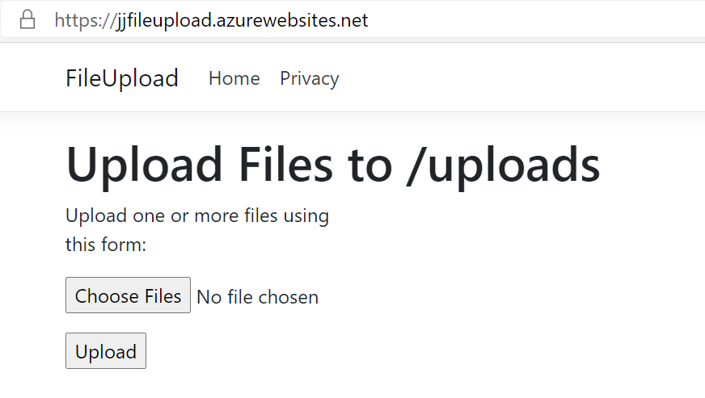
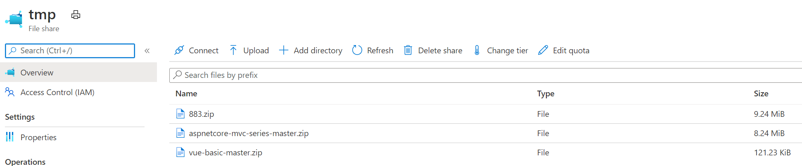
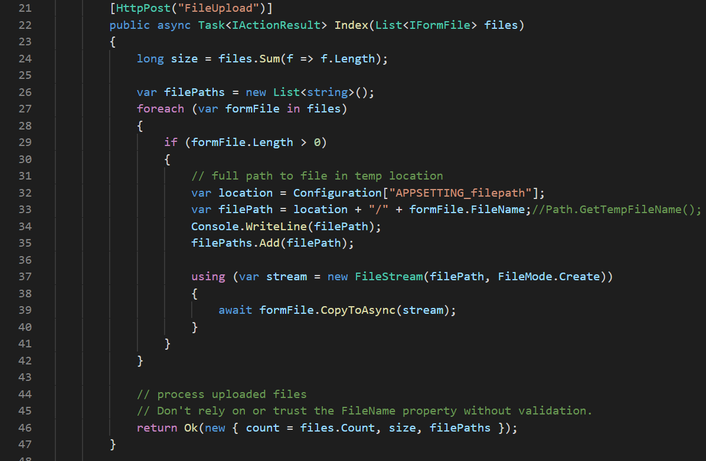
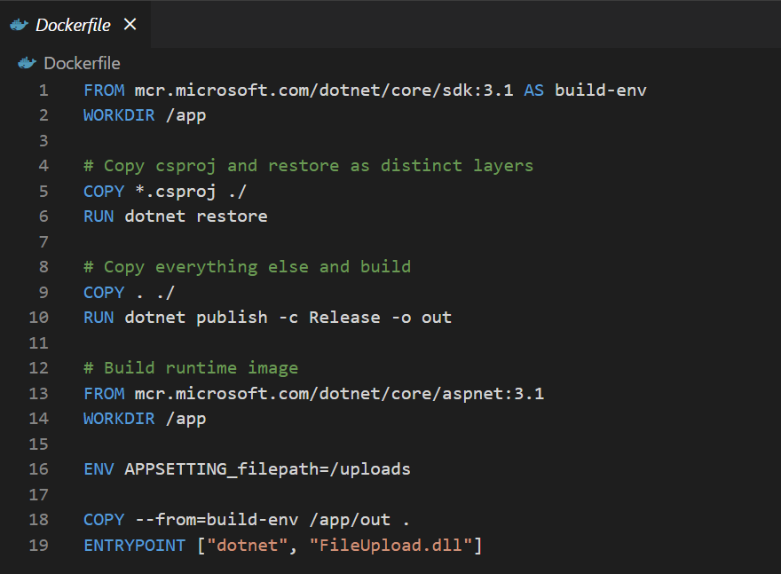
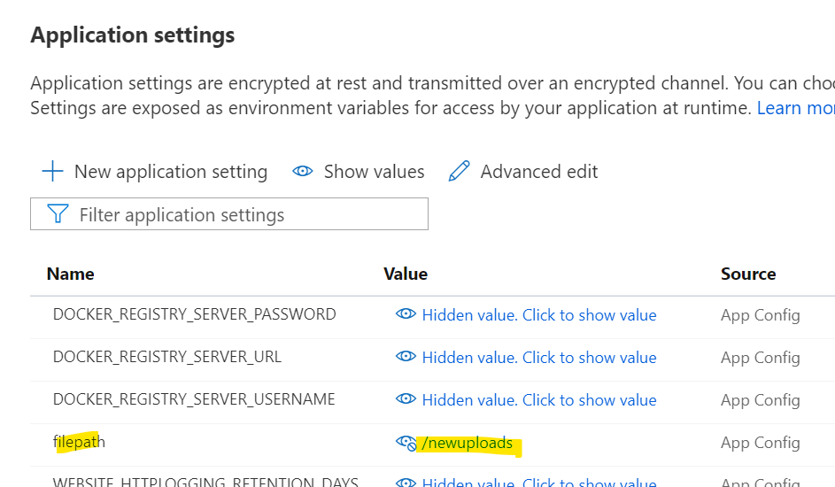

# Web App for Containers persistent storage

This is a demonstration of how persistent storage may be used with Azure Web App for Containers. This demo uses Azure storage files attached to the web app to provide persistance for uploaded files. It also demonstrates how to use environment variables to drive settings from the web app through the container into the container's ASP.NET core code to allow parameterisation of settings.

This is an adaption of some sample code from here https://github.com/CodeMazeBlog/aspnetcore-mvc-series/tree/master/Part6/FileUpload

## What the application does
The application is a simple file upload one where you select a file and then upload its contents. 

This then stores the selected file into an Azure storage file. This is a sample and is way too simplistic for real-life purposes as any user could upload large files into storage, so it is suggested that if you build this, you enable some authentication on the web app to only allow authenticated users to use the application.

After a file has been uploaded, it can be seen in the Azure storage file share:

## Code to upload files
The code is slightly amended from the sample code, to allow the file to be copies to a path in the container that will be mapped by the web app later.

As can be seen above, it pulls in an application setting called *APPSETTING_filepath* which contains the destination path. Note the use of the prefix *APPSETTINGS_* - this is a prefix that the Azure web app for containers adds to any application setting that gets injected into the container.

## Dockerfile

Note the use of the *ENV* setting and how this is made to match that used in the code.

## Web Application Settings

Note that the name used is just *filepath* - this is because the web app runtime addes the prefix *APPSETTINGS_* to the setting before injecting this into the container.

So what you can do is change the application setting *filepath* to point to a different Azure file share and then the uploads will land there:

## Web app path mappings

In order for the application to use Azure files for storage, Azure storage file shares need to be created and mounted as paths into the container.

